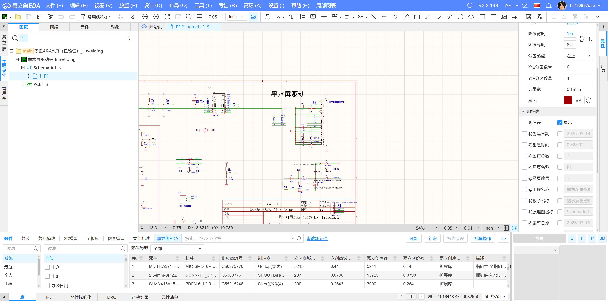
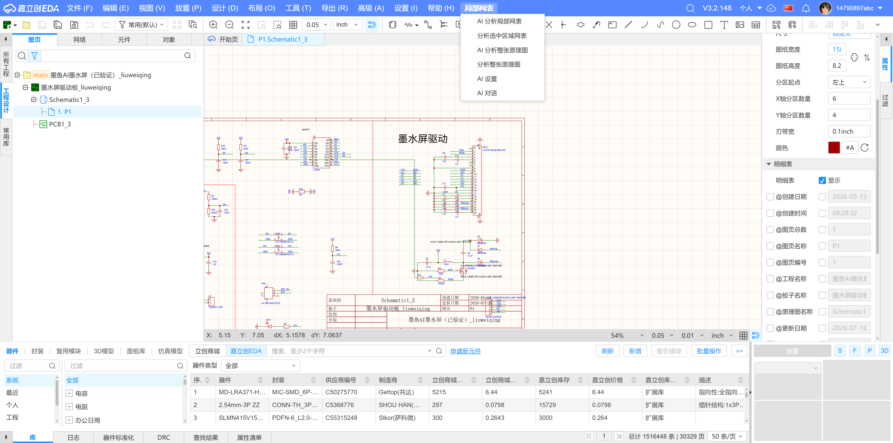
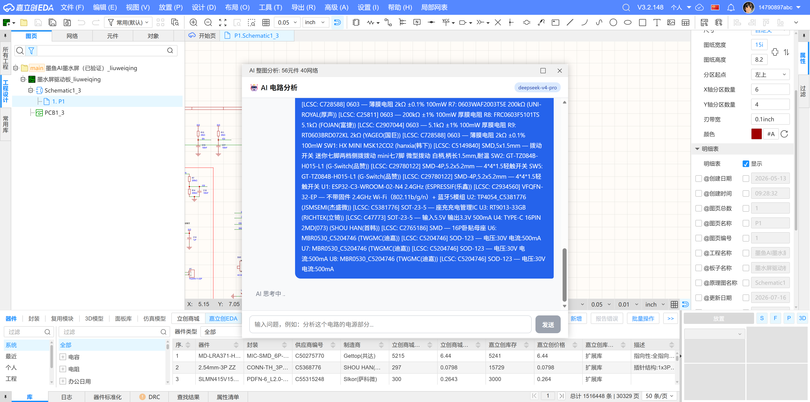
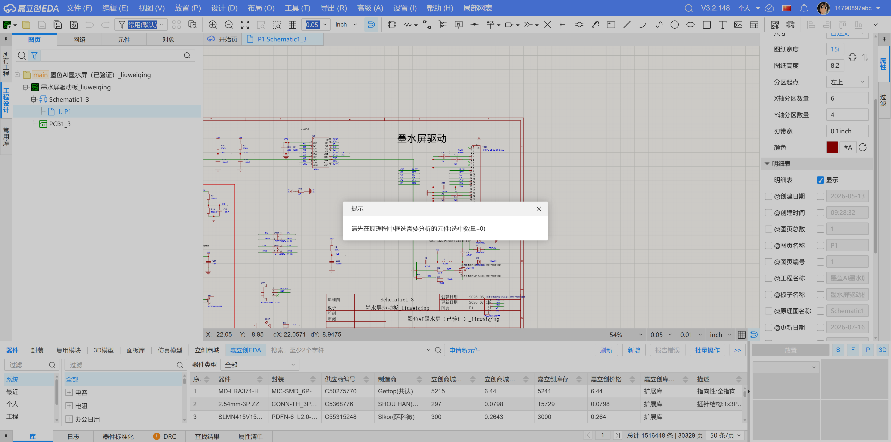

# 局部网表分析器 — Local Netlist Analyzer

嘉立创 EDA 专业版扩展插件。框选原理图区域，自动提取选中元件关联的局部网表，用于 AI 电路分析或人工快速查看连接关系。


## 为什么需要这个插件

现有 EDA AI 插件要么只能查全量网表（数据太多），要么只能查单个元件（粒度太粗）。这个插件填补了中间地带——**只导出你关心的那片电路的网表**。

## 功能

- 🖱️ **框选模式**:原理图中框选元件 → 自动识别所有选中器件(网表 + 引脚对应关系)
- 🌍 **整图模式**:一键分析整张原理图,无需框选(v1.5.0+)
- 🤖 **AI 一键分析**:把网表 + 器件型号/LCSC 编号送给 AI,自动分析电路功能、电源轨、信号路径与潜在风险(v1.4.0+ 起在 prompt 里带 `DeviceName` / `Value` / `LCSC Part Name`)
- 📋 **结构化展示**:dialog 简显 + 完整数据存到 `__nl_data`,手动 AI 提问也能用
- 💾 **可选 CSV/JSON 导出**(默认关闭,需在 AI 设置中开启)
- 🎨 **暗色主题 UI**,与 EDA 编辑器风格一致

## 演示

启动后,顶部菜单多出 **局部网表** 一栏:



点击后展开 6 个子项 — 局部网表分析、AI 一键、整图分析、AI 设置、AI 对话:



**整图分析**:一键出 AI 分析,自动列出 56 个元件的 LCSC 编号清单 + 让 deepseek-v4-pro 推理:



**未框选时**点"分析选中区域"会提示先框选:



## 安装

1. 下载最新的 `.eext` 文件(从 [GitHub Releases](https://github.com/14790897/local-netlist-analyzer/releases) 选最新版本)
2. 打开嘉立创 EDA 专业版
3. 顶部菜单 → **设置** → **扩展** → **扩展管理器** → **导入扩展**
4. 选择 `.eext` 文件即可
5. 导入后,到 **高级** → **扩展管理器** → **已安装** → 找到本扩展 → 勾选"在顶部菜单显示" 才能让菜单出现在顶栏(默认仅在原理图右键菜单)

## 使用

### 模式 A:整图分析(推荐,无需框选)
1. 打开一个原理图
2. 顶部菜单 → **局部网表** → **分析整张原理图**(只出网表 dialog)或 **AI 分析整张原理图**(直接开 AI 面板自动分析)
3. dialog 给出 `整图分析: 56元件 40网络` + 前 6 个网络明细;AI 面板给完整分析

### 模式 B:框选局部
1. 打开一个原理图
2. 在画布上拖框选择一片电路(必须包含至少 1 个器件或 pin)
3. 顶部菜单 → **局部网表** → **分析选中区域网表** 或 **AI 分析局部网表**
4. dialog 给出 `37选中 16元件 13网络 · $1N20473(2pin) · GND(3pin) · ...`;第二行是器件型号清单 `U1: ESP32-C3-WROOM-02-N4 · 2.4GHz · R1: 10kΩ ...`

### AI 设置
顶部菜单 → **局部网表** → **AI 设置** 配 endpoint / API key / model,以及是否保存网表文件。

## 技术栈

- **TypeScript** + 嘉立创 EDA Pro API SDK
- 使用的核心 API：
  - `SCH_SelectControl.getSelectedPrimitives()` — 获取框选元件
  - `SCH_Netlist.getNetlist()` — 获取全量网表
  - `SCH_PrimitiveComponent.getAllPins()` — 获取元件引脚
  - `SCH_PrimitiveComponent.getState_*()` — 获取元件属性

## 开发

```bash
# 克隆 SDK
git clone https://github.com/easyeda/pro-api-sdk.git

# 安装依赖
npm install

# 开发
修改 src/index.ts

# 构建
npm run build
# 输出: build/dist/local-netlist-analyzer_vX.X.X.eext
```

## 参考文档

- [API 参考总览](./docs/API-REFERENCE.md)
- [SCH_SelectControl](./docs/api/SCH-SelectControl.md) — 选择控制
- [SCH_Netlist](./docs/api/SCH-Netlist.md) — 网表获取
- [ISCH_Primitive / ISCH_PrimitiveComponent](./docs/api/ISCH-Primitive.md) — 图元类型定义
- [官方 API 文档](https://prodocs.lceda.cn/cn/api/reference/)
- [SDK 类型定义](./node_modules/@jlceda/pro-api-types/index.d.ts)

## License

Apache-2.0
